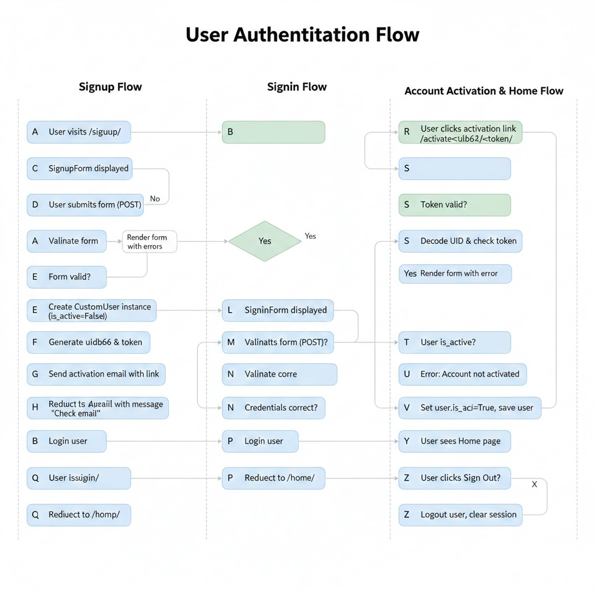

# **Django Email-Verified Authentication – Detailed Program Flow**


---

## **1. URL Routing – How Requests Are Handled**

Django maps HTTP requests to view functions via URL patterns.

**Main URLconf (`AUTH/urls.py`)**:

```python
urlpatterns = [
    path('admin/', admin.site.urls),
    path('', include('authentication.urls')),
]
```

* Requests starting with `'/'` are routed to the `authentication` app.
* Other requests (e.g., `/admin/`) are handled by Django’s admin.

**App URLconf (`authentication/urls.py`)**:

```python
urlpatterns = [
    path('', views.home, name='home'),
    path('signup/', views.signup, name='signup'),
    path('signin/', views.signin, name='signin'),
    path('signout/', views.signout, name='signout'),
    path('activate/<uidb64>/<token>/', views.activate, name='activate'),
]
```

* Each URL maps to a **view function**.
* `activate/<uidb64>/<token>/` passes parameters to `activate()` for email verification.

**Key Insight:**
Django first matches URLs in order. The first match triggers its corresponding view function.

---

## **2. Models – Custom User**

**`authentication/models.py`**

```python
class CustomUser(AbstractUser):
    email = models.EmailField(unique=True)
    is_active = models.BooleanField(default=False)
```

* Inherits all fields of `AbstractUser` (username, password, first/last name, etc.)
* **Email** is unique → ensures no duplicate registrations.
* **is_active = False** initially → prevents login before verification.

**Program Flow:**

1. User submits signup form → model instance is created (but not yet saved with `is_active=True`).
2. Email verification link activates the user → `is_active` set to `True`.

---

## **3. Forms – Input Handling & Validation**

### **SignupForm**

```python
class SignupForm(UserCreationForm):
    first_name = forms.CharField(max_length=50)
    last_name = forms.CharField(max_length=50)
    email = forms.EmailField()
```

* Extends Django's `UserCreationForm` → automatically validates:

  * Password1 & Password2 match
  * Username uniqueness
* `clean_email()` ensures no duplicate emails.

**Flow:**

1. User submits form
2. Django calls `is_valid()`
3. Validation pipeline:

   * Field type check
   * Password matching
   * Email uniqueness (`clean_email`)
4. Returns `True` or `False` → either saves user or renders form with errors.

### **SigninForm**

* Extends `AuthenticationForm`.
* Validates credentials (username & password).
* No need for extra email check at this stage because only registered users can log in.

---

## **4. Views – Core Logic**

### **Home View**

```python
def home(request):
    return render(request, 'authentication/home.html')
```

* Simple GET view
* Displays navigation links based on `user.is_authenticated`
* No form handling

**Flow:**

1. User requests `/` → URL dispatcher maps to `home()`
2. Template renders with `user` context (Django automatically injects user via middleware)

---

### **Signup View**

```python
def signup(request):
    if request.method == 'POST':
        form = SignupForm(request.POST)
        if form.is_valid():
            user = form.save(commit=False)
            user.is_active = False
            user.save()
```

**Step-by-Step Flow:**

1. **POST Request:**

   * User submits signup form
   * Django creates `SignupForm(request.POST)` instance
2. **Validation:**

   * `form.is_valid()` triggers `clean_*` methods
   * Passwords checked, email uniqueness checked
   * If invalid → errors returned and rendered in template
3. **User Creation:**

   * `form.save(commit=False)` → creates user object without saving to DB
   * `user.is_active = False` → prevents login until email verified
   * `user.save()` → saves user to DB
4. **Email Activation:**

   * `urlsafe_base64_encode(force_bytes(user.pk))` → encodes user ID
   * `account_activation_token.make_token(user)` → creates secure token
   * `activation_link` formed with domain, uidb64, token
5. **Send Email:**

   * `send_mail(subject, message, settings.DEFAULT_FROM_EMAIL, [user.email])`
   * In dev mode → prints to console
6. **Redirect & Message:**

   * Success message → "Account created! Check console for activation link."
   * Redirects to `signin` page

**Key Concepts:**

* **Tokens:** Ensure activation links are secure & unique
* **Email Verification:** Decouples account creation from login

---

### **Activation View**

```python
def activate(request, uidb64, token):
    uid = force_str(urlsafe_base64_decode(uidb64))
    user = User.objects.get(pk=uid)
    if account_activation_token.check_token(user, token):
        user.is_active = True
        user.save()
```

**Flow:**

1. User clicks link in email
2. URL passes `uidb64` and `token` to view
3. Decode UID → get user
4. Verify token → ensures link wasn’t tampered
5. Set `user.is_active = True`
6. Success message → redirect to login

**Failure Cases:**

* Invalid UID or token → shows error, redirects to signup

---

### **Signin View**

```python
def signin(request):
    form = SigninForm(request, data=request.POST)
    if form.is_valid():
        user = form.get_user()
        if not user.is_active:
            messages.error(...)
```

**Flow:**

1. POST request with username & password
2. Form validation:

   * Username exists
   * Password matches
3. Check `is_active`:

   * If `False` → error message (email not verified)
4. Login with `login(request, user)`
5. Redirect to home

---

### **Signout View**

```python
def signout(request):
    logout(request)
    messages.success(...)
    return redirect('home')
```

* Calls Django’s `logout()` → clears session
* Displays success message
* Redirects to home

---

## **5. Templates – Rendering**

**Template Flow:**

1. Base template (`base.html`) → header, navigation, messages
2. Child templates (`signup.html`, `signin.html`, `home.html`) → extend base
3. Form rendering:

   * `{{ form.as_p }}` → automatically displays fields & errors
4. Messages:

   * `messages` context variable displays success/error alerts
5. Conditional links:

   * `` → navigation dynamically changes

---

## **6. Email Activation Mechanics**

**Token Generator:**

```python
account_activation_token = PasswordResetTokenGenerator()
```

* Creates time-sensitive, secure token
* Prevents replay attacks
* Encoded UID + token sent in email link

**Activation Link Structure:**

```
http://127.0.0.1:8000/activate/<uidb64>/<token>/
```

**Process:**

* User clicks → `activate()` view
* Decode UID → get user
* Check token validity → activate account

---

## **7. Security Considerations**

* **Password validation:** Uses Django built-in validators
* **Inactive users:** Cannot log in until email verified
* **Token security:** `PasswordResetTokenGenerator` ensures link cannot be forged
* **Unique email constraint:** Prevents duplicate registration

---

## **8. Summary of Program Flow (Full Lifecycle)**

1. User visits `/signup/` → submits form
2. Django validates form → creates `CustomUser` (inactive)
3. Activation email sent → contains secure link
4. User clicks activation link → `activate()` called
5. User account set to `is_active = True`
6. User visits `/signin/` → logs in successfully
7. Authenticated user navigates → `/home/`
8. Logout clears session → `/home/` shows login/signup again

---

✅ **Key Takeaways**

* Django forms handle validation and security automatically.
* Email verification decouples signup from login → improves security.
* Token-based activation is secure and time-sensitive.
* URL patterns map directly to view functions → central to program flow.
* Templates use context variables (`user`, `messages`) to dynamically render content.

