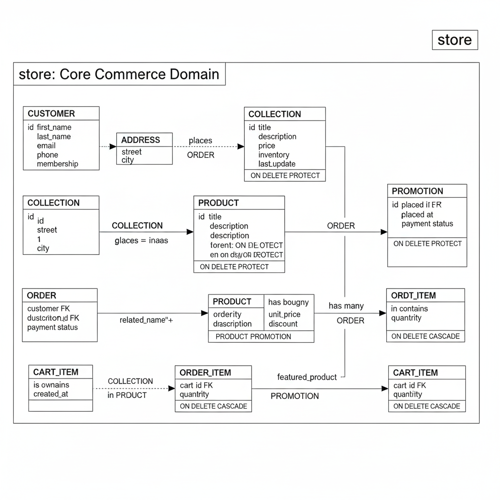
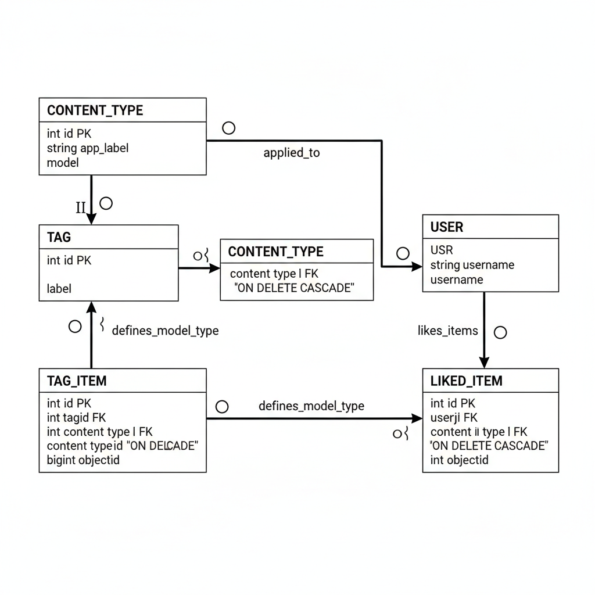
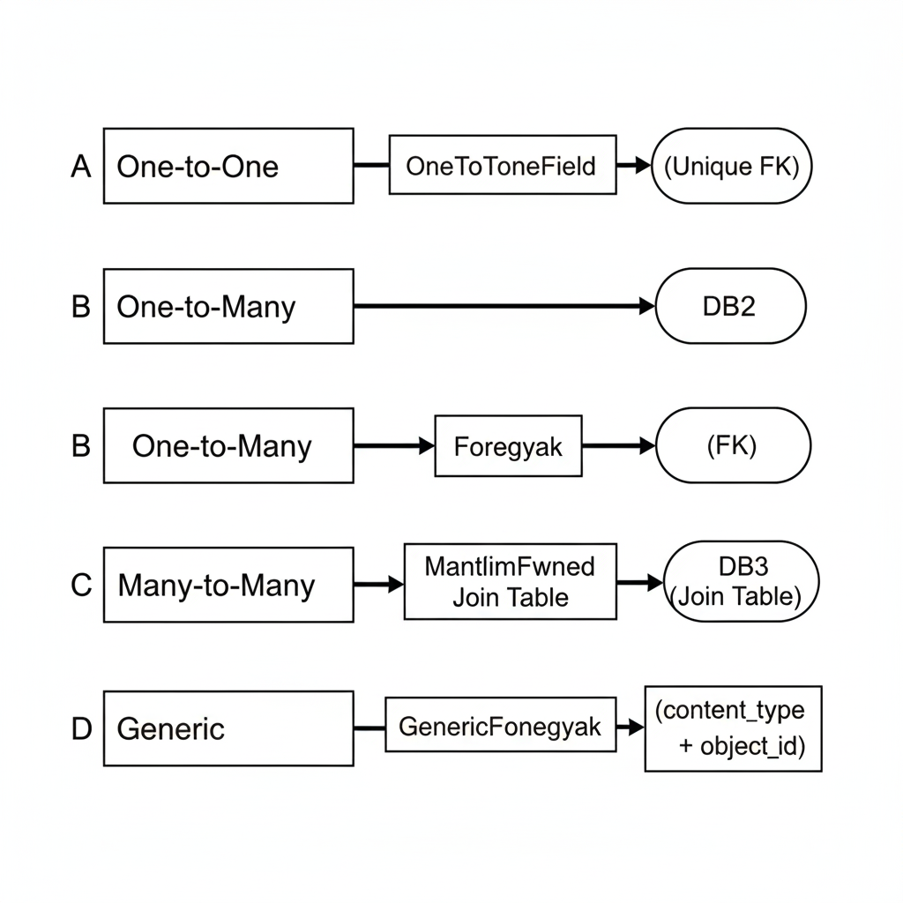
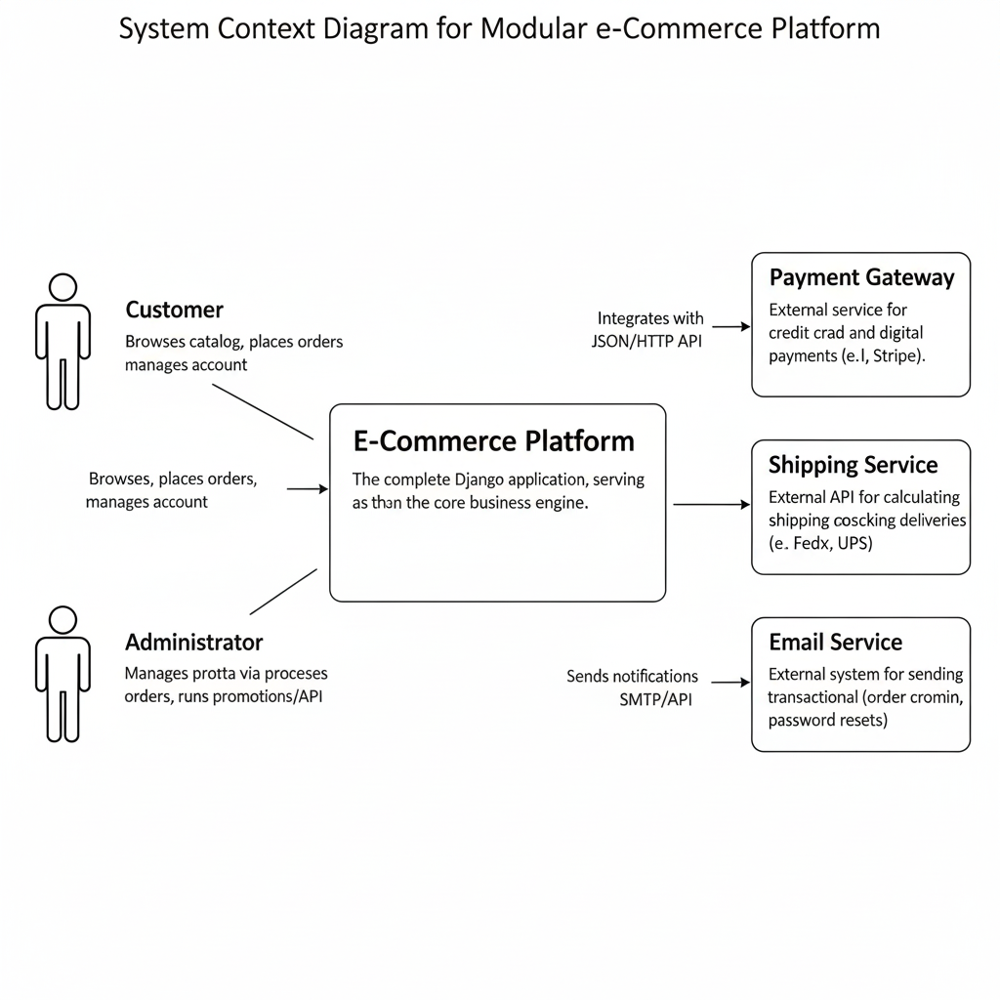
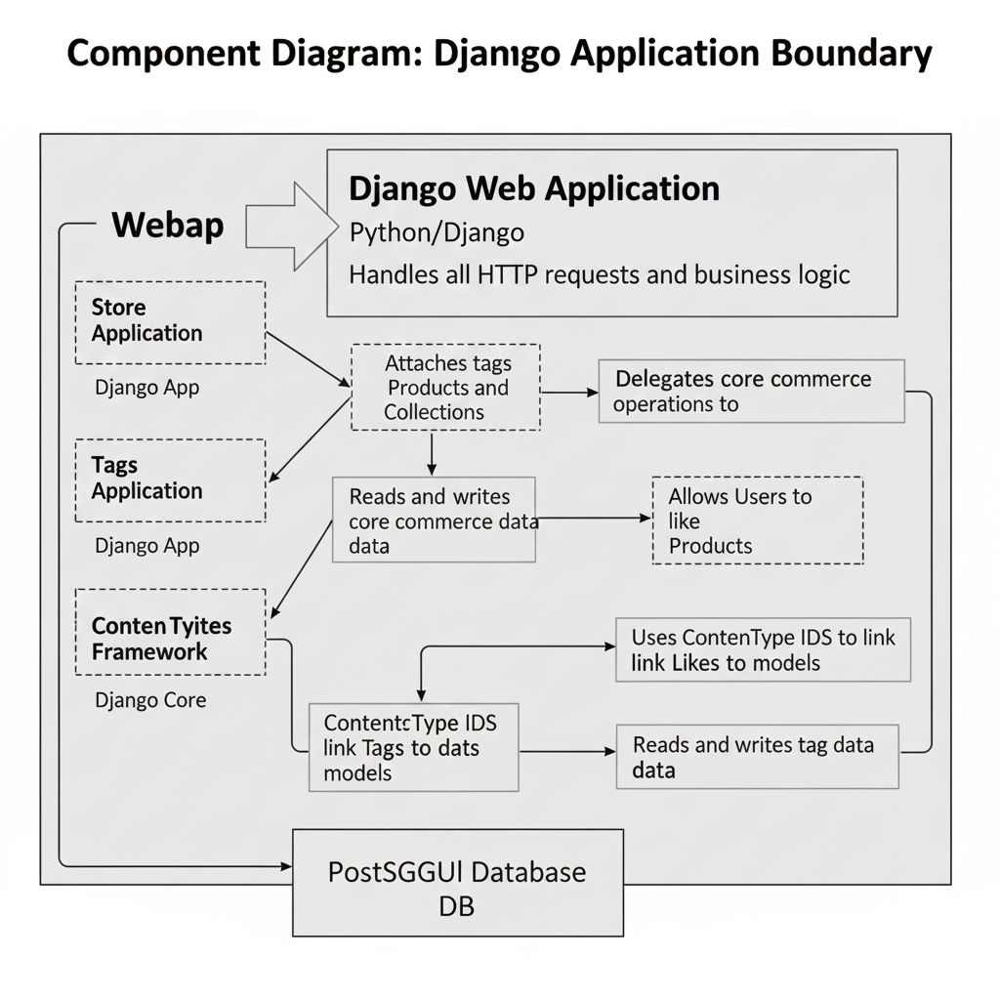
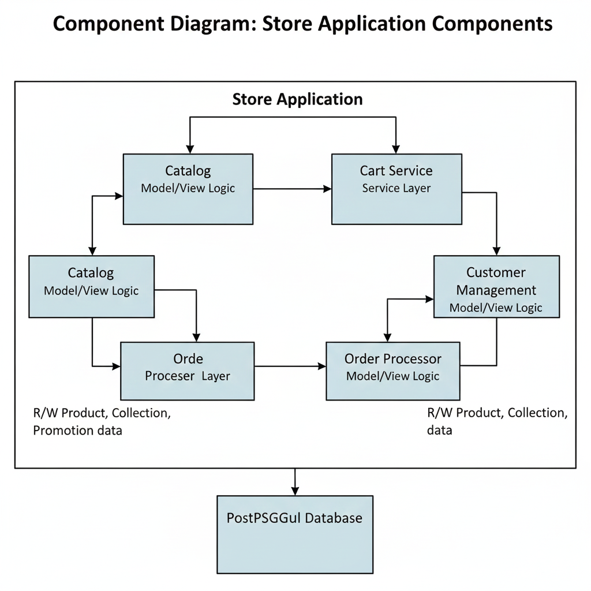
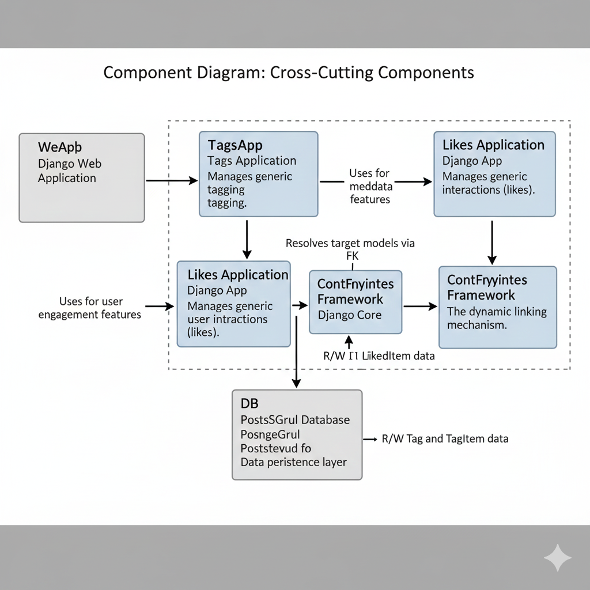

# **Data Model Architecture for a Modular E-Commerce Platform**

*A structural, extensible, and domain-driven design using Django ORM*

This document presents the conceptual and technical foundations of a modular e-commerce platform implemented in Django.
The system is decomposed into three loosely coupled applications:

1.  **store** — the core commerce domain (catalog, customers, carts, orders)
2.  **tags** — a reusable, model-agnostic metadata subsystem
3.  **likes** — a generic user-interaction subsystem

The architecture emphasizes **domain separation**, **referential integrity**, and **cross-cutting extensibility**, leveraging Django constructs including `ForeignKey`, `ManyToManyField`, and `GenericForeignKey`.

# **1. Store Application — Core Commerce Domain**

The **store** app implements the primary e-commerce domain model. It captures long-lived business data (products, customers, orders) and short-lived session data (carts).

## **1.1 Promotion**

```python
class Promotion(models.Model):
    description = models.CharField(max_length=255)
    discount = models.FloatField()
```

A **Promotion** represents a reusable pricing modifier.
Products may reference multiple promotions, enabling compound and time-bounded pricing strategies.

## **1.2 Collection**

```python
class Collection(models.Model):
    title = models.CharField(max_length=255)
    featured_product = models.ForeignKey(
        'Product', on_delete=models.SET_NULL, null=True, related_name='+')
```

A **Collection** groups products under marketing or thematic categories.
`related_name='+'` prevents an unnecessary reverse relation, reducing model noise.

## **1.3 Product**

```python
class Product(models.Model):
    title = models.CharField(max_length=255)
    description = models.TextField()
    price = models.DecimalField(max_digits=7, decimal_places=2)
    inventory = models.IntegerField()
    last_update = models.DateTimeField(auto_now=True)
    collection = models.ForeignKey(Collection, on_delete=models.PROTECT)
    promotions = models.ManyToManyField(Promotion)
```

The **Product** model captures the central sellable entity.
Key design choices:

  * **Immutable auditability** — order items store historical pricing.
  * **Referential robustness** — `PROTECT` prevents deletion of referenced collections.
  * **Promotional flexibility** — `ManyToManyField` provides extensible pricing logic.

## **1.4 Customer**

```python
class Customer(models.Model):
    ...
    membership = models.CharField(
        max_length=1, choices=MEMBERSHIP_CHOICES, default=MEMBERSHIP_BRONZE)
```

A **Customer** records user identity and segmentation attributes.
The `membership` field supports loyalty tiers and personalized pricing strategies.

## **1.5 Order**

```python
class Order(models.Model):
    placed_at = models.DateTimeField(auto_now_add=True)
    payment_status = models.CharField(
        max_length=1, choices=PAYMENT_STATUS_CHOICES,
        default=PAYMENT_STATUS_PENDING)
    customer = models.ForeignKey(Customer, on_delete=models.PROTECT)
```

An **Order** represents a transactional purchase.
`PROTECT` ensures financial data cannot be cascaded away, maintaining compliance and traceability.

## **1.6 OrderItem**

```python
class OrderItem(models.Model):
    order = models.ForeignKey(Order, on_delete=models.PROTECT)
    product = models.ForeignKey(Product, on_delete=models.PROTECT)
    quantity = models.PositiveSmallIntegerField()
    unit_price = models.DecimalField(max_digits=7, decimal_places=2)
```

Each **OrderItem** is a line item snapshot.
The **unit price** is persisted at purchase time, ensuring historical price fidelity.

## **1.7 Address**

```python
class Address(models.Model):
    street = models.CharField(max_length=255)
    city = models.CharField(max_length=255)
    customer = models.ForeignKey(Customer, on_delete=models.CASCADE)
```

An **Address** is owned by its customer and removed automatically when the customer is deleted.

## **1.8 Cart and CartItem**

```python
class Cart(models.Model):
    created_at = models.DateTimeField(auto_now_add=True)
```

```python
class CartItem(models.Model):
    cart = models.ForeignKey(Cart, on_delete=models.CASCADE)
    product = models.ForeignKey(Product, on_delete=models.CASCADE)
    quantity = models.PositiveSmallIntegerField()
```

The cart subsystem models ephemeral, session-level interactions.
`CASCADE` semantics ensure cleanup of obsolete cart structures.

# **2. Tags Application — Generic Tagging Subsystem**

The **tags** app implements a reusable tagging mechanism using Django’s **ContentTypes** framework and `GenericForeignKey`.

## **2.1 Tag**

```python
class Tag(models.Model):
    label = models.CharField(max_length=255)
```

A **Tag** is a standalone semantic label (e.g., *Holiday*, *Exclusive*, *Sale*).

## **2.2 TagItem**

```python
class TagItem(models.Model):
    tag = models.ForeignKey(Tag, on_delete=models.CASCADE)
    content_type = models.ForeignKey(ContentType, on_delete=models.CASCADE)
    object_id = models.PositiveBigIntegerField()
    content_object = GenericForeignKey()
```

A **TagItem** associates a tag with any model instance, enabling metadata attachment without schema changes.

# **3. Likes Application — Generic User-Interaction Subsystem**

The **likes** app provides a generic mechanism for registering user endorsements.

## **3.1 LikedItem**

```python
class LikedItem(models.Model):
    user = models.ForeignKey(User, on_delete=models.CASCADE)
    content_type = models.ForeignKey(ContentType, on_delete=models.CASCADE)
    object_id = models.PositiveIntegerField()
    content_object = GenericForeignKey()
```

A **LikedItem** records a user’s affirmative interaction with any target model (e.g., a product, article, or media item).

# **4. Architectural Rationale**

## **4.1 Separation of Concerns**

  * **store** encapsulates core business logic.
  * **tags** and **likes** implement cross-cutting functionality independent of the domain.
  * Modular boundaries support clearer reasoning, independent deployment, and feature isolation.

## **4.2 Referential Integrity**

Deletion rules are deliberately chosen:

| Relationship Type | Strategy                     | Rationale                                              |
| :---------------- | :--------------------------- | :----------------------------------------------------- |
| `PROTECT`         | Orders, customers, products  | Ensures financial and historical data remain immutable |
| `CASCADE`         | Addresses, carts, cart items | Automatic cleanup of dependent and ephemeral data      |
| Stored history    | e.g., `OrderItem.unit_price` | Maintains pricing audit trails                         |
## **4.3 Extensibility via ContentTypes**

Cross-cutting concerns (tags, likes) can attach to any model **without database migrations**, supporting rapid feature evolution and independent app development.

## **4.4 Real-World Alignment**

The architecture supports:

  * Historical pricing and compliance
  * Promotional flexibility
  * Loyalty programs
  * Session-based cart interactions
  * Extensible catalog metadata
  * User-interaction services

# **5. Visual Models**

## **5.1 Store Application — ER Diagram**



## **5.2 Tags and Likes — ER Diagram**




## **5.3 UML Class Diagram**


# **6. Relational Semantics in Django**

A brief mapping between classical relational semantics and Django ORM constructs.

## **6.1 One-to-One**

```python
class CustomerProfile(models.Model):
    user = models.OneToOneField(User, on_delete=models.CASCADE)
```

Implemented via a unique foreign key ensuring strict 1:1 pairings.


## **6.2 One-to-Many**

```python
class Order(models.Model):
    customer = models.ForeignKey(Customer, on_delete=models.PROTECT)
```

The foreign key resides on the "many" side, providing fine-grained deletion semantics.


## **6.3 Many-to-Many**

```python
class Product(models.Model):
    promotions = models.ManyToManyField(Promotion)
```

Models share a join table automatically generated unless explicitly specified.


## **6.4 Generic Relationships**

Used for **TagItem** and **LikedItem**, bypassing schema coupling at the cost of lacking DB-level referential constraints.

## **6.5 Relationship Summary**



# **7. Generic Models in Django**

Generic models produce flexible, schema-independent associations by tracking:

1.  `content_type` — the model class
2.  `object_id` — the target primary key
3.  `content_object` — the dynamically resolved instance

This mechanism is central to reusable subsystems such as tags, likes, and activity feeds.


# **8. Conclusion**

The proposed design establishes a **robust**, **maintainable**, and **extensible** foundation for an e-commerce ecosystem.
The **store** app enforces strict relational semantics for core business operations, while **tags** and **likes** provide reusable cross-cutting capabilities through Django’s generic relationships.
This hybrid approach—classical relational modeling with selective generic flexibility—offers a future-proof architecture capable of evolving with product and feature demands.


# **C4 Model — High-Level Technical Architecture**

(All diagrams preserved and reorganized for clarity.)


## **C1. System Context**



## **C2. Container Architecture**


## **C3. Component Architecture (Django Application Boundary)**




## **C3.1 Store Application Components**



## **C3.2 Cross-Cutting Components: Tags and Likes**

